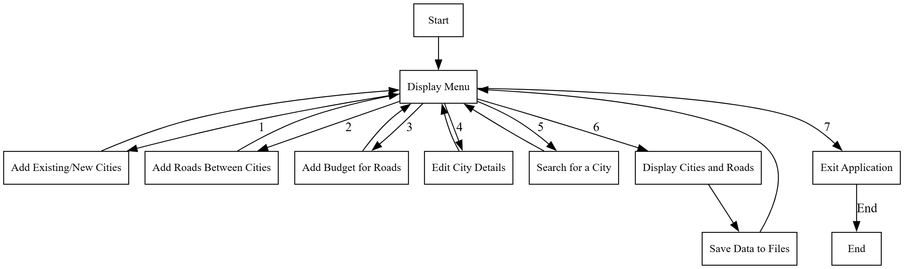

# 🛣️ Rwanda Transport Management System

[](https://isocpp.org/std/the-standard)
[](https://cmake.org/)
[](LICENSE)

A sophisticated C++ console application designed for the Rwanda Ministry of Infrastructure to manage and track the country's transport infrastructure. The system efficiently handles city connections, road networks, and budget allocations between Rwanda's capital city (Kigali) and its secondary cities.

## 🌟 Key Features

- 📍 **City Management**

  - Record and manage existing cities
  - Add new secondary cities
  - Modify city details
  - Search city information

- 🛣️ **Road Network Management**

  - Add and manage roads between cities
  - Track road budgets
  - Visualize road connections using adjacency matrices

- 📊 **Data Visualization**

  - Graph-based representation of roads
  - Budget allocation tracking
  - Interactive console display

- 💾 **Data Persistence**
  - Automatic data saving
  - File-based storage
  - Easy data recovery

## 📋 System Flowcharts

The system's architecture and functionality are documented in two comprehensive flowcharts:

1. **Summarized Flowchart** - High-level system overview
   

2. **Detailed Flowchart** - In-depth implementation details
   

## 📁 Project Structure

```
transport/
├── 📂 include/              # Header files
│   ├── City.h              # City class definition
│   ├── Road.h              # Road class definition
│   ├── Graph.h             # Graph class for adjacency matrices
│   └── FileManager.h       # File handling utilities
│
├── 📂 src/                 # Source files
│   ├── City.cpp            # City class implementation
│   ├── Road.cpp            # Road class implementation
│   ├── Graph.cpp           # Graph class implementation
│   ├── FileManager.cpp     # File handling implementation
│   └── main.cpp            # Main program entry point
│
├── 📂 data/               # Data files
│   ├── cities.txt         # City records
│   └── roads.txt          # Road records
│
├── 📂 flowcharts/         # System flowcharts
│   ├── summarized-flowchart.png
│   └── detailed-flowchart.png
│
└── CMakeLists.txt         # CMake build configuration
```

## 🚀 Getting Started

### Prerequisites

- C++ compiler (g++ or MSVC)
- CMake (version 3.10 or higher)
- Git (for version control)

### Installation

1. Clone the repository:

```bash
git clone https://github.com/yourusername/rwanda-transport.git
cd rwanda-transport
```

2. Create and enter build directory:

```bash
mkdir build && cd build
```

3. Generate build files:

```bash
cmake ..
```

4. Build the project:

```bash
cmake --build .
```

## 💻 Usage

Run the compiled executable to start the application:

```bash
./RwandaTransport
```

### Main Menu Options

1. 📍 Add new city(ies)
2. 🛣️ Add roads between cities
3. 💰 Add the budget for roads
4. ✏️ Edit city
5. 🔍 Search for a city using its index
6. 📋 Display cities
7. 🛣️ Display roads
8. 📊 Display recorded data on console
9. 🚪 Exit

## 📊 Data Management

The system maintains two primary data files:

- `cities.txt`: Stores city records with indices and names
- `roads.txt`: Contains road connections and their associated budgets

## 🤝 Contributing

1. Fork the repository
2. Create your feature branch (`git checkout -b feature/AmazingFeature`)
3. Commit your changes (`git commit -m 'Add some AmazingFeature'`)
4. Push to the branch (`git push origin feature/AmazingFeature`)
5. Open a Pull Request

## 📝 License

This project is licensed under the MIT License - see the [LICENSE](LICENSE) file for details.

## 👥 Authors

- Your Name - _Initial work_

## 🙏 Acknowledgments

- Rwanda Ministry of Infrastructure
- All contributors who have helped shape this project
