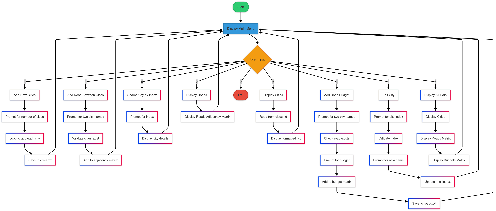

# Rwanda Transport Management System

A C++ console application for managing Rwanda's transport infrastructure, including cities and roads between them.

## Features

- Record and manage cities
- Add and manage roads between cities
- Track road budgets
- Search and display city information
- Graph-based representation of roads and budgets
- Data persistence using text files

## System Flowcharts

The system's functionality is documented in two flowcharts:

1. **Summarized Flowchart** - Provides a high-level overview of the system's main operations
   

2. **Detailed Flowchart** - Shows the detailed implementation flow of each operation
   

## Project Structure

```
transport/
├── include/              # Header files
│   ├── City.h           # City class definition
│   ├── Road.h           # Road class definition
│   ├── Graph.h          # Graph class for adjacency matrices
│   └── FileManager.h    # File handling utilities
│
├── src/                 # Source files
│   ├── City.cpp         # City class implementation
│   ├── Road.cpp         # Road class implementation
│   ├── Graph.cpp        # Graph class implementation
│   ├── FileManager.cpp  # File handling implementation
│   └── main.cpp         # Main program entry point
│
├── data/               # Data files
│   ├── cities.txt      # City records
│   └── roads.txt       # Road records
│
├── flowcharts/         # System flowcharts
│   ├── summarized-flowchart.png
│   └── detailed-flowchart.png
│
└── CMakeLists.txt      # CMake build configuration
```

## Building the Project

### Prerequisites

- C++ compiler (g++ or MSVC)
- CMake (version 3.10 or higher)

### Build Instructions

1. Create a build directory:

```bash
mkdir build
cd build
```

2. Generate build files:

```bash
cmake ..
```

3. Build the project:

```bash
cmake --build .
```

## Usage

Run the compiled executable to start the application. The program provides the following menu options:

1. Add new city(ies)
2. Add roads between cities
3. Add the budget for roads
4. Edit city
5. Search for a city using its index
6. Display cities
7. Display roads
8. Display recorded data on console
9. Exit

## Data Files

The program maintains two data files:

- `cities.txt`: Contains city records (index and name)
- `roads.txt`: Contains road records (road connection and budget)
